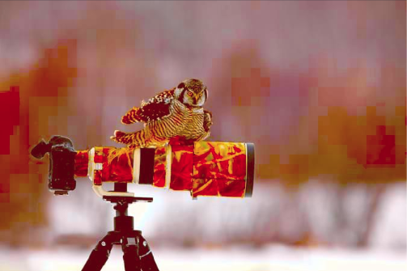
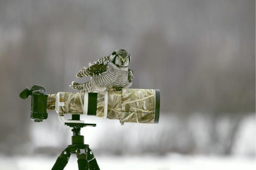
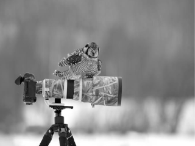

# Automatic Content-Aware Color and Tone Stylization
This is a simple realization of the paper __Automatic Content-Aware Color and Tone Stylization__ .

Change the style of your image, automatically.

## Example

| Before | After |
| :--: | :--: |
|  |  |
|  |  |

## How to use

### Environment

1. Caffe
1. Python 3.5
1. Numpy
1. Scipy
1. Scikit-learn
1. Scikit-image
1. OpenCV
1. Redis [Optional]

### Claw Images From Flickr

You can get a temporary API KEY from [THIS PAGE]( https://www.flickr.com/services/api/explore/flickr.interestingness.getList).

### Create Image Style Dataset

I create this database by hand: visit https://500px.com/popular , press "Page Down" button, and save the page. Then, delete non-image files.

### Clean the Dataset [Optional]

Run `util_reshape_demo_image.py` to reshape the images. The longest edge will be changed into 800px.

### Feature Extract

Run `process_deep_feature.py` to extract deep feature in BAD database.

Run `process_feature_extract.py` to extract style features in GOOD and BAD database.

### K-Means

Run `process_kmeans.py` to obtain semantic clusters.

### Get the Relation Between Semantic and Style

Run `process_mapping.py`

### RUN

1. `run_transfer_test.py` transfers image style using example image you specified.
1. `run_transfer_single.py` transfers image style using example image find in GOOD dataset. We will mapping your image to ONE cluster.
1. `run_transfer_multi.py` transfers image style using example image find in GOOD dataset. We will mapping your image to SEVERAL clusters.

## Notice

+ We MUST made __something wrong__ while coding. The result is not really good. Please correct bugs using PR.

+ If you just want to run a demo, please rename the folder `data-demo` to `data`, and RUN.

## Cite

Please refer to _Automatic Content-Aware Color and Tone Stylization_ by Lee et.al.

```bibtex
@article{lee2015automatic,
  title={Automatic Content-Aware Color and Tone Stylization},
  author={Lee, Joon-Young and Sunkavalli, Kalyan and Lin, Zhe and Shen, Xiaohui and Kweon, In So},
  journal={arXiv preprint arXiv:1511.03748},
  year={2015}
}
```

## WARNING

THE PROGRAM IS DISTRIBUTED IN THE HOPE THAT IT WILL BE USEFUL, BUT WITHOUT ANY WARRANTY. IT IS PROVIDED "AS IS" WITHOUT WARRANTY OF ANY KIND, EITHER EXPRESSED OR IMPLIED, INCLUDING, BUT NOT LIMITED TO, THE IMPLIED WARRANTIES OF MERCHANTABILITY AND FITNESS FOR A PARTICULAR PURPOSE. THE ENTIRE RISK AS TO THE QUALITY AND PERFORMANCE OF THE PROGRAM IS WITH YOU. SHOULD THE PROGRAM PROVE DEFECTIVE, YOU ASSUME THE COST OF ALL NECESSARY SERVICING, REPAIR OR CORRECTION.

IN NO EVENT UNLESS REQUIRED BY APPLICABLE LAW THE AUTHOR WILL BE LIABLE TO YOU FOR DAMAGES, INCLUDING ANY GENERAL, SPECIAL, INCIDENTAL OR CONSEQUENTIAL DAMAGES ARISING OUT OF THE USE OR INABILITY TO USE THE PROGRAM (INCLUDING BUT NOT LIMITED TO LOSS OF DATA OR DATA BEING RENDERED INACCURATE OR LOSSES SUSTAINED BY YOU OR THIRD PARTIES OR A FAILURE OF THE PROGRAM TO OPERATE WITH ANY OTHER PROGRAMS), EVEN IF THE AUTHOR HAS BEEN ADVISED OF THE POSSIBILITY OF SUCH DAMAGES.
